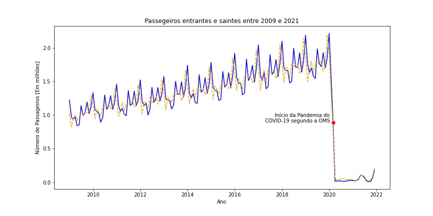
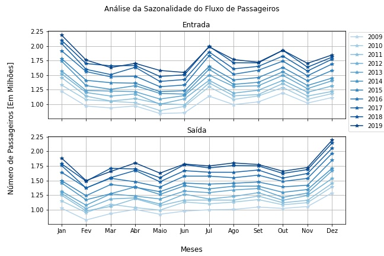
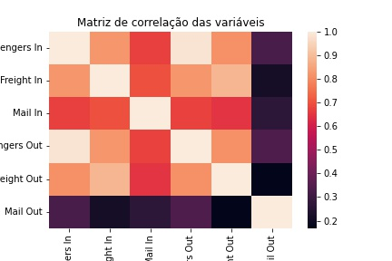
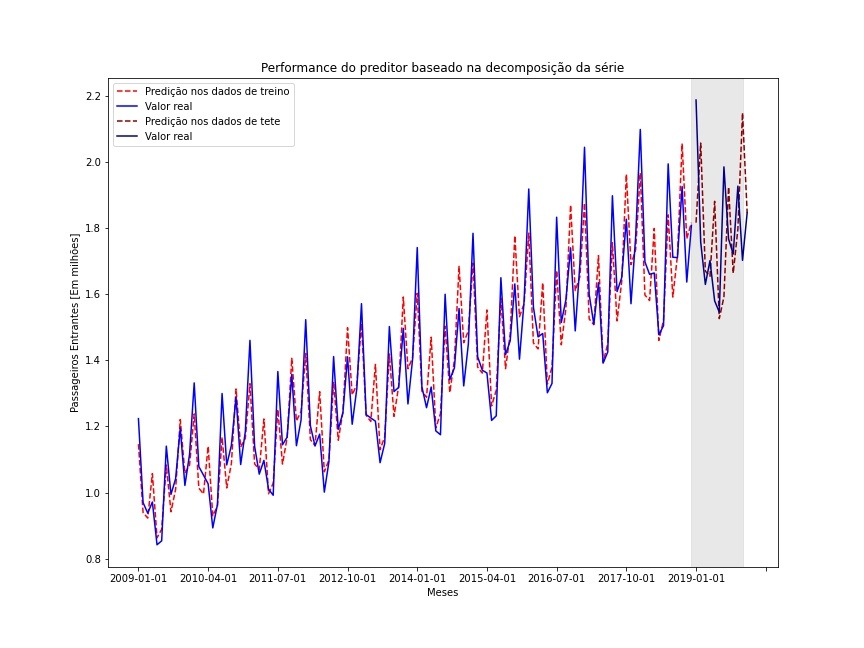
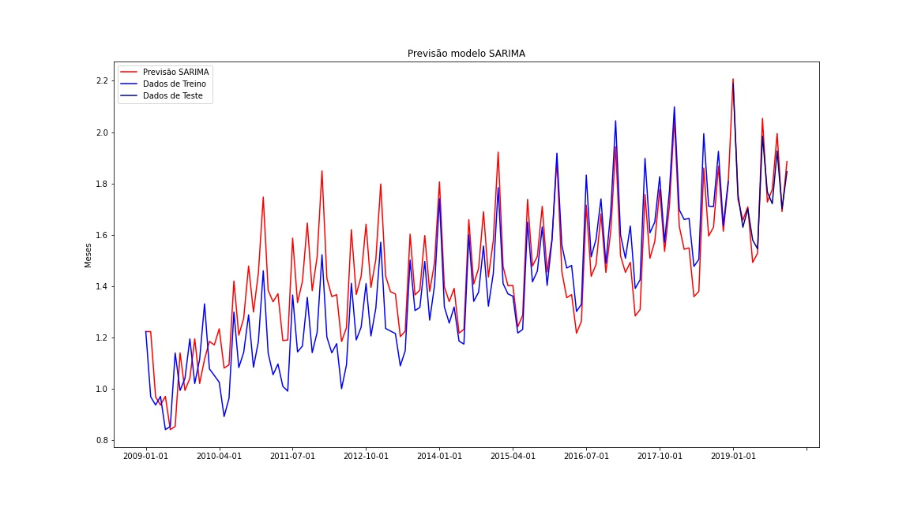
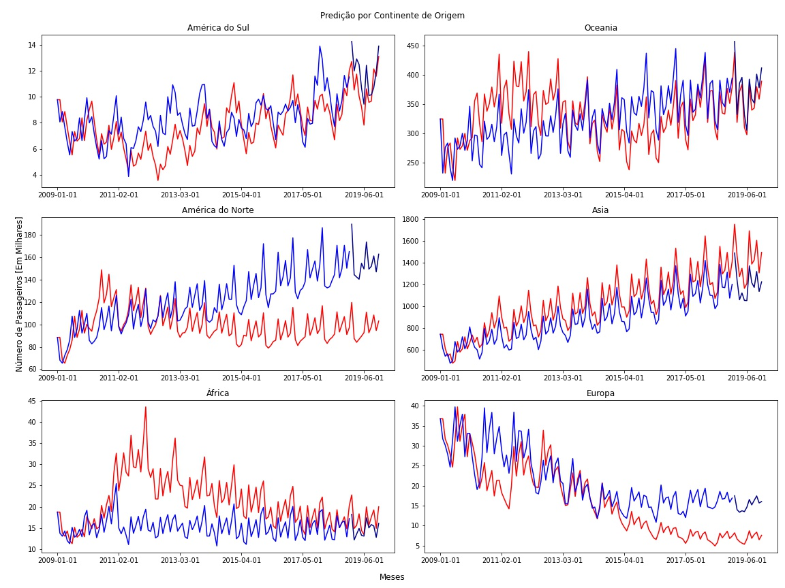

# Predição do Número de passageiros entrantes na Austrália

O objetivo desse teste é analisar os dados de viagens aéreas para Austrália e criar um modelo preditivo para a demanda de passagens aéreas, observando características como sazonalidades e quebras de regime.

O desenvolvimento foi todo feito em Python através de dois Jupyter Notebooks.

Os modelos treinados estão na pasta **Models/**.

## Dependências
Python 3.93.7 (não testado em outras versões)

Bibliotecas utilizadas
* pandas
* numpy
* matplotlib
* seaborn
* pycountry
* pycountry_convert
* sklearn
* statsmodels

## Notebooks 

O primeiro deles consta (Data_Analysis) corresponde á análise exploratória dos dados.

O segundo (Time_series_prediction) corresponde ao desenvolvimento da solução de predição. Duas abordagens foram testadas, a primeira com o ajuste de uma função senóidal,e a outra com um modelo SARIMA. 

## Resultados

### Análise dos Dados

#### Quebra de regime 
Durante a exploração dos dados, notou-se um forte efeito de sazonalidade anual no número de passageiros entrantes e que saem da Áustralia, com uma importante quebra de regime por conta da pandemia. Os dados correspondendo a 2020 e 2021 foram então desconsiderados para a modelagem. 

#### Sazonalidade
Evidencia-se por exemplo, um pico no número de passageiros entrantes nos meses de Janeiro e Julho. Mais análises sobre a sazonalidade podem ser encontradas no notebook Data_Analysis

corr_matrix
#### Correlação 
Notou-se também uma forte correlação positiva entre as variáveis do dataset, com a exceção da quantidade de correio que sai do país. Isto é interessante para a eventual expansão a técnicas com multivariáveis 

### Predição 

#### Modelagem - Ajuste função seno
A série foi decomposta em uma tendência de aumento, um componente de sazonalidade e resíduos, usando um método multiplicativo. 

Para a tendência, uma simples regressão linear se provou suficiente, já para a sazonalidade foi necessário ajustar uma função com duas componentes senóidais, uma para cada sazonalidade encontada (Uma que se repete a cada ano, e outra que repete todo segundo semestre).

A validação do modelo foi feita com os dados do ano de 2019, ou seja, $t+12$ passos.

Estes foram os resultados encontrados:

|                    |            |           |
|--------------------|:----------:|-----------|
| Método             | MSE Treino | MSE Teste |
|  Regressão Linear  |  0.000304  |     -     |
| Ajuste Função Seno |  0.003093  |     -     |
|   Predição Total   |  0.006777  |  0.060112 |
|                    |            |           |

#### SARIMA
Este modelo é aplicável em séries estacionárias. Foi realizado o teste de hipótese que comprovou que não era o caso, então uma estacionarização foi realizada com base nas primeiras diferenças logarítimicas. Em seguida, os parâmetros do modelo SARIMA foram estimados visualmente atráves da Autocorrelação Parcial e Autocorrelação, e selecionados com base em qual combinação resultava no melhor critério AIC. 

A validação do modelo foi feita como anteriormente

|     | Treino   | Teste    |
|-----|----------|----------|
| MSE | 0.021300 | 0.002086 |
|     |          |          |

Como podemos ver, as métricas de teste obtidas com esta abordagem são menores do que com a abordagem anterior
Este modelo será então o escolhido para a predição. Este método caputra de forma muito mais clara a sazonalidade da série. Vemos um também uma deslocação temporal de uma unidade, porque se trata de uma modelagem de previsão. 

#### SARIMA por continente de origem

O mesmo processo foi repetido para os passageiros de origem de cada continente. Os resultados obtidos desta vez não foram satisfatórios.

| Continente       | MSE Treino  | MSE Teste |   |   |
|------------------|-------------|-----------|---|---|
| América do Sul   | 2.67        | 1.92      |   |   |
| Oceania          | 2081.53     | 276.63    |   |   |
| América do Norte | 1113.69     | 3440.97   |   |   |
| Ásia             | 182777.18   | 52706.04  |   |   |
| África           | 65.19       | 7.50      |   |   |
| Europa           | 43.21       | 69.48     |   |   |
|                  |             |           |   |   |

### Possíveis continuações 

* Análise mais detalhada sobre o número de passageiros entrantes por continente, afim de descobrir informações que possam melhor a performances destes modelos
* Explorar o modelo SARIMA com outras variáveis exógenas, como por exemplo número de passageiros que saem
* Explorar o uso de LSTMs 